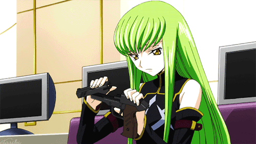

  

### 👨‍💻 **About Me**
I’m a first-year **Software Engineering** student at **ITMO University**, specializing in **System and Applied Software**. 
Now fully focused on growing as a **Go developer** and specializing in backend systems.
Before Go, I primarily worked with **C++** and **machine learning** using **Python**.

### 🛠 **Languages & Frameworks**

  
  
  
  
  
  
  

### **Databases & Tools**

  
  

### 🔧 **Instruments**

  
  

#### 📚 **Education**
- **ITMO University**  
  Bachelor’s in Software Engineering (1st year)  
  Focus: System and Applied Software

#### Competitive Programming
- Prize winner in the **Rosatom Informatics Olympiad**.
- Prize winner in the **"Step into the Future" Programming Olympiad**.

