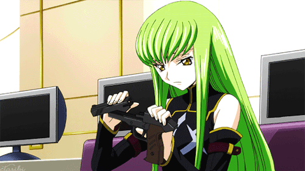

  

## Fancy seeing you here! 
I’m a first-year **Software Engineering** student at **ITMO University**, specializing in **System and Applied Software**. 
I worked with **Golang**, **Playwright**, **Python**, **C++** and **Java**. Also tried **machine learning** but I didn't really like it.

### 🛠 **Languages & Frameworks**

  
  
  
  
  
  
  
  
  

### 🔧 **Databases & Instruments**

  
  
  
  
  
  
  
  

#### 📚 **Education**
- **ITMO University**  
  Bachelor’s in Software Engineering (1st year)  
  Focus: System and Applied Software

#### Competitive Programming
- Prize winner in the **Rosatom Informatics Olympiad**.
- Prize winner in the **"Step into the Future" Programming Olympiad**.

